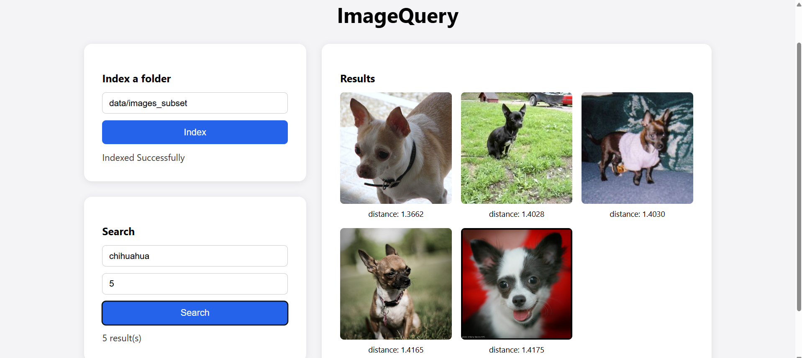

# ImageQuery

A text-query-driven image search engine over a local folder of images, powered by CLIP embeddings and a FastAPI backend.

Point it at any folder of images on your machine, type a text query like `"chihuahua"` or `"guitar"`, and get back the most visually/semantically matching images — ranked by CLIP similarity, no manual browsing required.



## How it works

1. **Indexing** — every image in the target folder is passed through CLIP's vision encoder, projected into a shared 512-dimensional embedding space, and stored in a persistent LanceDB vector table.
2. **Search** — a text query is passed through CLIP's text encoder into the same embedding space, and LanceDB returns the nearest image vectors by cosine similarity.
3. **Serving** — a FastAPI backend exposes `/index` and `/search` endpoints, plus a `/image` endpoint that streams back the actual matched image files for the frontend to render as thumbnails.

## Tech stack

- **CLIP** (`openai/clip-vit-base-patch32`) via Hugging Face `transformers` — shared image/text embedding space
- **LanceDB** — persistent vector storage and similarity search
- **FastAPI** — backend API
- **Vanilla HTML/CSS/JS** — no frontend framework

## Setup

```bash
git clone https://github.com/mohitkrishna21/ImageQuery.git
cd ImageQuery
python -m venv venv
venv\Scripts\Activate.ps1   # Windows PowerShell
pip install -r requirements.txt
uvicorn fastapi_backend:app --reload
```

Open `http://127.0.0.1:8000` in your browser.

## Usage

1. Enter the path to a folder of images and click **Index**.
2. Enter a text query (e.g. a breed name, object, or description) and click **Search**.
3. Results render as a thumbnail grid, ranked by similarity distance (lower = closer match).

## Evaluation

Accuracy was measured with a custom precision@5 script (`evaluate.py`) against a 200-image test set spanning 10 dog breeds:

**Average precision@5: 0.98**
This significantly outperforms the ~0.10 expected from random chance on this dataset, confirming CLIP is performing genuine semantic discrimination between breeds rather than superficial matching.

## Project structure
```
ImageQuery/
├── image_search_pipeline.py   # core CLIP + LanceDB pipeline (indexing, embedding, search, logging)
├── fastapi_backend.py         # FastAPI app: /index, /search, /image, and frontend serving
├── evaluate.py                 # standalone precision@k offline evaluation script
├── index.html                  # single-page frontend
├── requirements.txt            # Python dependencies
├── demo.png                    # demo screenshot
├── .gitignore
├── LICENSE
└── README.md
```

## Known limitations / future improvements

- `index_folder()` currently only reads files at the top level of a given folder (no recursive subfolder walking).
- Search results return full LanceDB records (including embedding vectors) rather than a trimmed response.

## License

MIT
